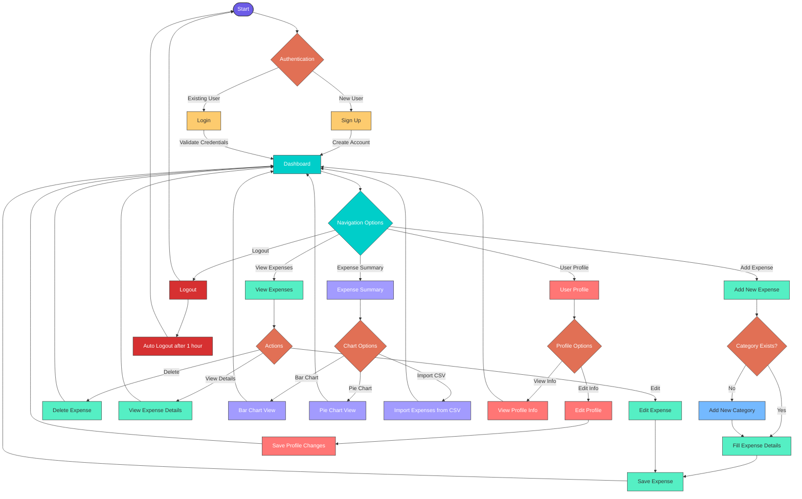

# ExpenseTracker
- Implemented robust APIs using Express.js and Node.js, enabling smooth data retrieval and manipulation.
- Ensured secure access to sensitive features by implementing user authentication and authorization mechanisms in this application.

# How to Use 👥 (Features of Application)
- Make an Account (SignUp) for first Time.
- If Already have an account please Login
- Dashboard Shows
- Please Click Add Expense on the Side Nav or on Plus icon to add new expense
- Here You can Add new Expense by providing details
- You can add your new Category if you want by ADD CATEGORY just above there and proceed to SAVE button.
- After getting message save expense now you can check on View Expense / Dashboard.
- You can See your Profile in Profile Option
- Also you can Edit your Name/ Username and SAVE it.
- Logout (Auto Logout in next 1 hour so don't worry 😊 )
- You can check Expense Summary using BAR chart and PIE charts.
- You can also Import Expense in CSV files.📩

# Flowchart
# flowchart

## Screenshots
# Dashboard - View Expense

# Home - Add Expense 

# Expense Summary

# Profile - User

Update info

# Edit Expense

# View Expense

# Import CSV File

# Logout

# Login

# SignUp

# Logger

# Database

## Development server
- Run `npm i` or `npm install`.
- Download Angular Material `ng add @angular/material`.
- Download Bootstrap `npm install bootstrap`.
- Run `ng serve`
- Navigate to  `http://localhost:4200/`.
- The application will automatically reload if you change any of the source files.

